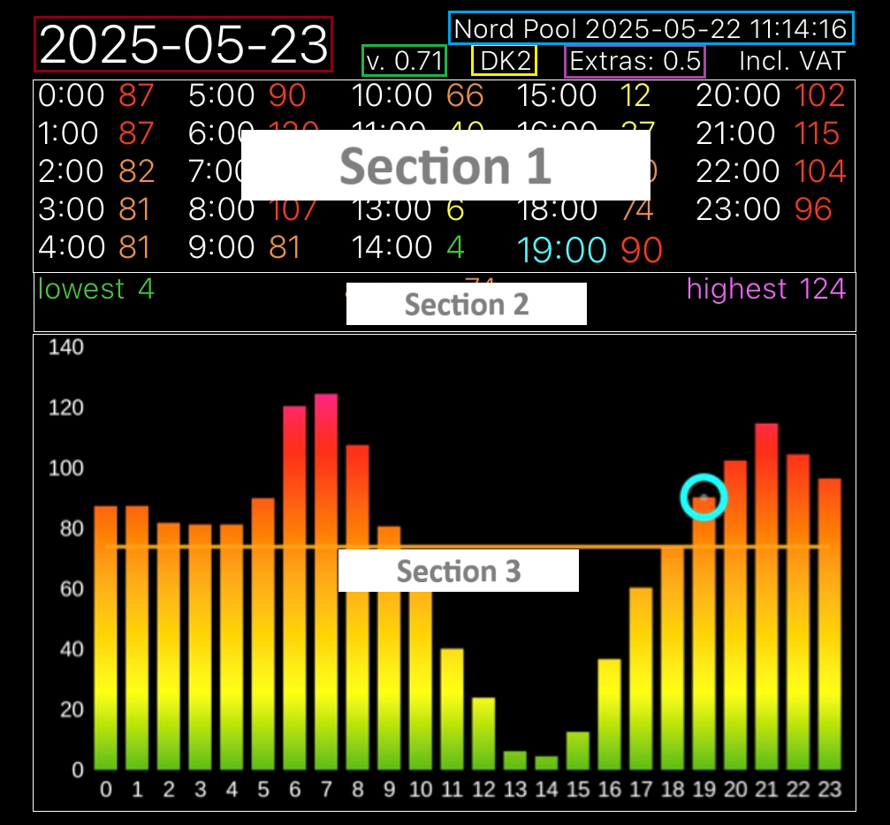

# ⚡️ Scriptable NordPool Widget

A simple and customizable Scriptable widget that displays **Nord Pool electricity prices** directly on your iPhone or iPad home screen.

---

## 📄 License

**Personal use only.** See [`LICENSE`](LICENSE) for details.

## ⚠️ Requirements

- iPhone or iPad  
- Scriptable app (free from the App Store)

## 📲 Install Scriptable

Download Scriptable here:  
[https://apps.apple.com/ca/app/scriptable/id1405459188](https://apps.apple.com/ca/app/scriptable/id1405459188)

## 🔧 How to Install

1. Go to the latest version of the script:  
   👉 [Download Nordpool.js](https://github.com/flopp999/Scriptable-NordPool/releases/latest/download/Nordpool.js)  
   and copy the entire content.
2. Open **Scriptable** and tap the **+** icon in the top right.
3. Paste the script, then tap **Play** (▶️) to run it.
4. Follow the setup instructions shown on screen.

## 🌐 Language Support

- ✅ English  
- ✅ Swedish  

Want support for another language? [Open an issue](https://github.com/flopp999/Scriptable-NordPool/issues) and I’ll add it!

---

## 💡 Tips

- Add the widget to your home screen by long-pressing, tapping **Edit Home Screen**, then tapping **+** to add a new widget.
- Select **Scriptable**, choose large size, and link it to your saved script.

---

## 📬 Feedback

Found a bug or have a feature request?  
👉 [Open an issue](https://github.com/flopp999/Scriptable-NordPool/issues)

---

## 🧩 Widget Guide

Explanation of the elements in the widget:

- 🟥 **Red box** – Date of the prices  
- 🟩 **Green box** – Script version  
- 🟨 **Yellow box** – Currency  
- 🟪 **Purple box** – Extra cost (prices in the list include these)  
- 🟦 **Blue box** – Datetime of the prices

---

Made with ❤️ by [@flopp999](https://github.com/flopp999)
